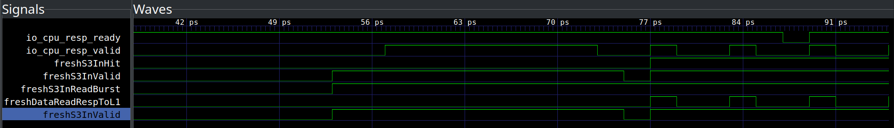

# 比赛提交报告

项目：UCAgent with Formal Verify
许可证：Apache 2.0
复现入口：`scripts/run_cases.sh`

## 摘要

本项目围绕 NutShell Cache 验证构建了一个可复现的 UCAgent 工作流，并额外提出一个通用形式验证 skill：`generic-formal`。核心思路是给 UCAgent 增加一个可调用的 formal backend，使 agent 不只会生成动态测试，还能先用 SymbiYosys 搜索短反例，再继续 Picker/Toffee/pytest 动态回归。

本轮交付保留 01-05 五个案例：

| Case | 定位 | 结论 |
| --- | --- | --- |
| 01 | 通用 formal skill 能力证明 | buggy adder `FAIL`，fixed adder `PASS` |
| 02 | NutShell PR21 真实历史 bug | pre `FAIL`，fixed `PASS` |
| 03 | NutShell PR74 真实历史接口 bug | pre `ELAB_FAIL/ERROR`，fixed `PASS` |
| 04 | latest L2 readBurst ready/valid candidate bug | formal 发现反例，Toffee 动态复现，场景覆盖 `5/5` |
| 05 | latest-only UCAgent + formal skill 覆盖闭环 | 15/15 declared functional coverage；1 个 latest candidate bug；3 个 UCAgent hypothesis 经人工 Verilog 波形复查未复现 |

## 基础环境与复现方式

安装源码与依赖：

```bash
bash scripts/setup_sources.sh
docker build -f docker/formal.Dockerfile -t nutshell-cache-formal:latest .
cp .ucagent_env.example .ucagent_env
source .ucagent_env
```

本地 smoke：

```bash
bash scripts/run_cases.sh --case all --with-formal --smoke
```

正式 UCAgent API：

```bash
source .ucagent_env
bash scripts/run_cases.sh --case 02 --with-formal
bash scripts/run_cases.sh --case 03 --with-formal
bash scripts/run_cases.sh --case 04 --with-formal
bash scripts/run_cases.sh --case 05
```

05 不支持 `--no-formal`，因为该案例目标就是展示 formal-enabled UCAgent flow。

## 01 案例 ：通用 Formal Skill 能力证明

来源：人工构造的最小 adder buggy/fixed RTL。

目的：证明 `generic-formal` 不是 04 专用工具，而是可对任意 RTL 运行的通用 formal runner。01 使用同一个 YAML 接口，对 buggy adder 得到 `FAIL`，对 fixed adder 得到 `PASS`。

证据：`reports/01_adder.md`

## 02 案例 ：PR21 MMIO Prefetch 历史 Bug

来源：NutShell PR #21 的真实历史修复。测试从 PR 前后 commit 生成真实 `nutcore.Cache`，不是 compact mock。

Bug 点：MMIO prefetch 与已有正常 cache pipeline entry 在关键窗口冲突。formal wrapper 通过真实 public Cache IO 驱动，并使用插入 probe 观察 s2/s3 pipeline 信号。

结果：

- pre：`FAIL`，形式验证找到历史反例。
- fixed：`PASS`，说明同一 property 在修复后不再报错。

证据：`reports/02_pr21.md`、`reports/02_pr21_ucagent_formal_skill.md`

## 03 案例 ：PR74 CacheIO idBits 历史接口 Bug

来源：NutShell PR #74 的真实历史修复。

Bug 点：OOO 风格 Cache 配置需要 `idBits`，PR 前版本在 elaboration/interface 层缺失 ID field，导致 wrapper 无法 elaborate。

结果：

- pre：`ERROR/ELAB_FAIL`，捕获 `CacheIO.in` 缺失 ID field。
- fixed：生成成功，formal property `PASS`。

证据：`reports/03_pr74.md`、`reports/03_pr74_ucagent_formal_skill.md`

## 04：L2 readBurst Ready/Valid Candidate Bug

来源：最新 NutShell Cache 的新场景。

触发条件：

1. 对同一地址发起 L2 `readBurst` miss。
2. 让内存模型完成 refill。
3. 再对同一地址发起第二次 `readBurst`，形成 hit。
4. 当请求处于 S3 hit/readBurst 窗口时，L1 侧 `resp_ready=0`。
5. 观察 `resp_valid` 是否仍主动拉高。

结论：在标准 Decoupled ready/valid 语义下，这是一个很强的 candidate bug；但如果 NutShell 设计者额外规定 L1 必须一直 ready，则需要在设计文档中明确写出该环境假设。

证据：

- formal skill：`reports/04_l2_readburst_formal_skill.md`
- dynamic replay：`reports/artifacts/04_l2_readburst/dynamic_readburst_ready_deadlock.md`
- VCD：`reports/artifacts/04_l2_readburst/artifacts/dynamic_readburst_ready_deadlock.vcd`
- 波形截图：`reports/assets/04_l2_readburst_ready_valid_waveform.png`
- Toffee coverage：`reports/04_l2_readburst_toffee_coverage.md`
- UCAgent full demo：`reports/04_l2_readburst_ucagent_full_demo.md`



截图中关键点：`freshS3InValid=1`、`freshS3InHit=1`、`freshS3InReadBurst=1` 表示已到达 L2 readBurst hit；同时 `io_cpu_resp_ready=0` 且 `io_cpu_resp_valid=0`。若接口遵守标准 Decoupled 语义，producer 不应等待 ready 才拉高 valid，否则 consumer 若等待 valid 再 ready，会形成死锁风险。

## 05：Latest-only UCAgent + Formal Skill 覆盖闭环

05 是独立 latest-only 部分，不引用 PR21/PR74 旧版本或历史证据。它要求 UCAgent 先调用 `generic-formal` skill，再继续 `RunTestCases` 执行 coverage closure。

覆盖口径：

- total：`15`
- implemented：`15`
- partial：`0`
- gap：`0`
- declared functional coverage：`100.0%`

这 15 个点覆盖 read hit/miss、readBurst backpressure、refill order、uncached/atomic policy、write mask、replacement、flush outstanding miss、coherence probe、ready/valid stability 等 latest Cache 功能风险点。

证据：

- coverage report：`reports/05_full_cache_coverage_plan.md`
- formal skill report：`reports/05_full_cache_formal_skill.md`
- UCAgent report：`reports/05_full_cache_coverage_plan_ucagent.md`
- latest candidate summary：`reports/05_ucagent_bug_candidates.md`
- 人工 Verilog 复查：`reports/05_manual_verilog_validation.md`
- 人工 Verilog VCD：`reports/artifacts/05_full_cache_coverage_plan/manual_hypothesis_probe.vcd`

05 中 UCAgent 额外提出了三个高风险 hypothesis：flush outstanding miss、dirty eviction ordering、partial mask merge。为了避免“纯 AI 误判”，这三个点被人工写成 Verilog probe/testbench，并通过 `iverilog + vvp` 直接施加激励、生成 VCD。当前人工波形复查结论是三者均未复现为 bug，因此不升级为 candidate bug。05 仍保留为 latest candidate bug 的只有 `CAND_LATEST_L2_READBURST_READY_VALID`。

## UCAgent 与人工分工

| 工作项 | UCAgent/AI | 人工 |
| --- | --- | --- |
| 读取任务、调用 skill、运行 pytest | 负责执行和记录工具调用 | 审查工具调用是否真实发生 |
| 生成测试和报告草稿 | 可生成、补强、总结 | 修正协议语义、环境假设和误报表述 |
| formal property | 可运行已有 property | 人工定义和审核 property 是否表达真实设计意图 |
| coverage plan | 可辅助补全候选点 | 人工定义 coverage closure 标准与 scoreboard oracle |
| bug 判定 | 可提出 hypothesis | 人工根据 formal/dynamic 证据签核 candidate bug |

## 有无 Formal Skill 的差异

| 能力 | 原始 UCAgent 流程 | 加入 `generic-formal` skill |
| --- | --- | --- |
| 生成/运行 Toffee pytest | 可以 | 可以 |
| 读取报告并解释现象 | 可以 | 可以 |
| 自动搜索 bounded counterexample | 不具备 | 具备 |
| fixed 版本 no-false-positive 检查 | 依赖动态回归 | 可直接跑 fixed `PASS` |
| 窄时序窗口定位 | 依赖 directed replay | formal 先找反例，再转动态复现 |

功能边界：`generic-formal` 是通用 runner，不是自动设计意图推理器。任意 Verilog 模块都能进入 smoke/formal 流程，但真正功能正确性仍需要 property、环境约束、reference model 和人工审核。

## 最终结论

AI/UCAgent 被放在一个受约束、可审计的工程流程里：它负责调用工具、生成总结和推进回归；人工负责验证策略、property、scoreboard、coverage 口径和 bug 签核。形式验证作为 agent skill 深度集成后，补上了 UCAgent 原本对短反例和窄时序协议 bug 的不足，并且仍能继续衔接官方 Toffee/pytest 流程。
